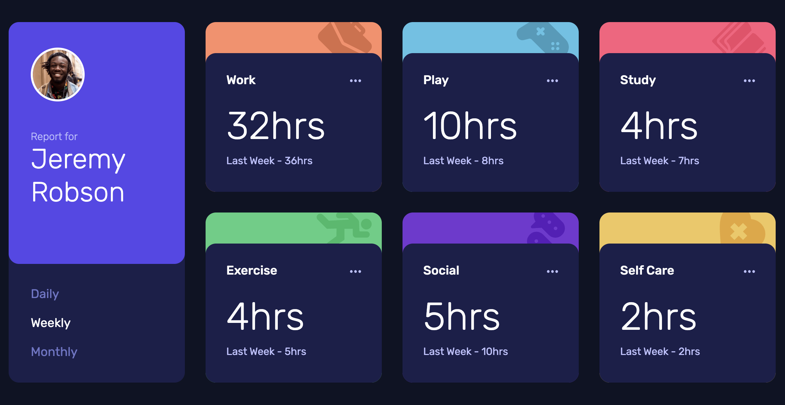

# Frontend Mentor - Time tracking dashboard solution

This is a solution to the [Time tracking dashboard challenge on Frontend Mentor](https://www.frontendmentor.io/challenges/time-tracking-dashboard-UIQ7167Jw). Frontend Mentor challenges help you improve your coding skills by building realistic projects.

## Table of contents

- [Overview](#overview)
  - [The challenge](#the-challenge)
  - [Screenshot](#screenshot)
  - [Links](#links)
- [My process](#my-process)
  - [Built with](#built-with)
  - [What I learned](#what-i-learned)
  - [Useful resources](#useful-resources)
- [Author](#author)


## Overview

### The challenge

Users should be able to:

- View the optimal layout for the site depending on their device's screen size
- See hover states for all interactive elements on the page
- Switch between viewing Daily, Weekly, and Monthly stats

### Screenshot



### Links

- [Solution URL](https://github.com/edpau/fm-time-tracking-dashboard)
- [Live Site URL](https://edpau.github.io/fm-time-tracking-dashboard/)

## My process

### Built with

- Semantic HTML5 markup
- CSS custom properties
- Flexbox
- CSS Grid
- Mobile-first workflow
- Typescript

**Note: These are just examples. Delete this note and replace the list above with your own choices**

### What I learned

#### Loop over the data

- start with manually setting the text content for each element one by one.

```typescript
const currentWork = document.querySelector(".card_current-work") as HTMLParagraphElement;
const previousWork = document.querySelector(".card_previous-work") as HTMLParagraphElement;
const currentPlay = document.querySelector(".card_current-play") as HTMLParagraphElement;
const previousPlay = document.querySelector(".card_previous-play") as HTMLParagraphElement;

if (currentWork && previousWork && currentPlay && previousPlay) {
  currentWork.innerText = `${events[0].timeframes.daily.current} hrs`;
  previousWork.innerText = `${events[0].timeframes.daily.previous} hrs`;
  currentPlay.innerText = `${events[1].timeframes.daily.current} hrs`;
  previousPlay.innerText = `${events[1].timeframes.daily.previous} hrs`;
} else {
  console.error("card elements are missing");
}
```

- To avoid manually setting the text content for each element one by one, I create a more dynamic and scalable solution. I use forEach to iterate over the events array and update the corresponding elements based on a consistent naming convention.

```typescript
function updateElements() {
  events.forEach((event) => {
    const currentElement = document.querySelector(`.card_current-${event.title.toLowerCase()}`) as HTMLParagraphElement;
    const previousElement = document.querySelector(`.card_previous-${event.title.toLowerCase()}`) as HTMLParagraphElement;

    if (currentElement && previousElement) {
      currentElement.innerText = `${event.timeframes.daily.current} hrs`;
      previousElement.innerText = `${event.timeframes.daily.previous} hrs`;
    } else {
      console.error(`${event.title} element is missing`);
    }
  });
}
```

- To avoid recreating the HTMLParagraphElement elements every time updateElements is called, I store references to these elements in as an object. This way, I can reuse the references without querying the DOM multiple times.

```typescript
const elementRefs: { [key: string]: { currentElement: HTMLParagraphElement; previousElement: HTMLParagraphElement } } = {};

function cacheElements() {
  events.forEach((event) => {
    const title = event.title.toLowerCase();
    elementRefs[title] = {
      currentElement: document.querySelector(`.card_current-${title}`) as HTMLParagraphElement,
      previousElement: document.querySelector(`.card_previous-${title}`) as HTMLParagraphElement,
    };
  });
}

function updateElements(currentPeriod: Period) {
  events.forEach((event) => {
    const element = elementRefs[event.title.toLowerCase()];
    if (element && element.currentElement && element.previousElement) {
      element.currentElement.innerText = `${event.timeframes[currentPeriod].current} hrs`;
      element.previousElement.innerText = `${event.timeframes[currentPeriod].previous} hrs`;
    } else {
      console.error(`${event.title} element is missing`);
    }
  });
}
```

#### Adding fallback or validation to handle invalid period selection

1. Fallback Approach

- Sets a default value ("weekly") if an invalid period is selected, allowing the dashboard to continue functioning without errors.

```typescript
function handlePeriodChange(e: Event) {
  const target = e.target;

  if (!(target instanceof HTMLElement)) {
    console.error("Cannot find button");
    return;
  }

  if (!(target instanceof HTMLButtonElement)) {
    return;
  }

  const clickPeriod = target.innerText.toLowerCase() as Period;

  // Fallback: Set to 'weekly' if the selected period is invalid
  const validPeriods: Period[] = ["daily", "weekly", "monthly"];
  if (!validPeriods.includes(clickPeriod)) {
    console.warn(`Invalid period selected: ${clickPeriod}. Falling back to 'weekly'.`);
    currentPeriod = "weekly"; // Fallback to 'weekly'
  } else {
    currentPeriod = clickPeriod; // Set to the valid period
  }

  updateElements(currentPeriod);
}
```

2. Validation Approach

- For validation, check if the selected period is valid before proceeding. If it’s invalid, display an error message without changing the current period:

```typescript
function handlePeriodChange(e: Event) {
  const target = e.target;

  if (!(target instanceof HTMLElement)) {
    console.error("Cannot find button");
    return;
  }

  if (!(target instanceof HTMLButtonElement)) {
    return;
  }

  const clickPeriod = target.innerText.toLowerCase() as Period;

  // Validation: Check if the selected period is valid
  const validPeriods: Period[] = ["daily", "weekly", "monthly"];
  if (validPeriods.includes(clickPeriod)) {
    currentPeriod = clickPeriod; // Set to the valid period
    updateElements(currentPeriod);
  } else {
    console.error(`Invalid period selected: ${clickPeriod}. Please select a valid period.`);
  }
}
```

- further improve, use a Set for validation, which is more efficient

```typescript
const validPeriods: Set<Period> = new Set(["daily", "weekly", "monthly"]);

if (!validPeriods.has(selectedPeriod)) {
  console.error(`The innerText of ${target.innerText} button does not match ValidPeriods`);
  window.alert("Something is wrong, please try again later.");
  return;
}
```

#### Handle the failure case in the init() function more explicitly

1. inform the user when data fetching fails,
2. disable UI elements to prevent interactions,
3. or provide fallback content.

```typescript
async function init() {
  // ... (other initialization code)
  // ... selects control and button elements, checks their existence, and adds a click event

  events = await getData();

  if (events.length === 0) {
    disableUI(buttons);
    window.alert("Cannot get Data, please try again later.");
    return;
  }

  cacheElements();
  updateElements(currentPeriod);
}

function disableUI(buttons: NodeListOf<HTMLButtonElement>) {
  buttons.forEach((button) => {
    console.log("click");
    button.disabled = true;
  });
}
```

#### The periodLabels logic in updateElements() could be simplified by storing the period messages in an object for lookup

- original code

```typescript
function updateElements(currentPeriod: Period) {
  let periodLabels = {};
  events.forEach((event) => {
    const element = elementRefs[event.title.toLowerCase()];

    if (currentPeriod === "daily") {
      periodLabels = "Yesterday - ";
    } else if (currentPeriod === "weekly") {
      periodLabels = "Last Week - ";
    } else {
      periodLabels = "Last Month - ";
    }

    if (element && element.currentElement && element.previousElement) {
      element.currentElement.innerText = `${event.timeframes[currentPeriod].current}hrs`;
      element.previousElement.innerText = `${periodLabels} ${event.timeframes[currentPeriod].previous}hrs`;
    } else {
      console.error(`${event.title} element is missing`);
    }
  });
}
```

- refactored with an object for look up

```typescript
function updateElements(currentPeriod: Period) {
  let periodLabels: { [key in Period]: string } = {
    daily: "Yesterday - ",
    weekly: "Last Week - ",
    monthly: "Last Month - ",
  };
  events.forEach((event) => {
    const element = elementRefs[event.title.toLowerCase()];
    const { current, previous } = event.timeframes[currentPeriod];

    if (element) {
      element.currentElement.innerText = `${current}hrs`;
      element.previousElement.innerText = `${periodLabels[currentPeriod]}${previous}hrs`;
    } else {
      console.error(`${event.title} element is missing`);
    }
  });
}
```

- further improve Readability with Constants:

  - define periodLabels outside the function since it's static and doesn't change. This will also avoid recreating the same object on every call to updateElements()

  ```typescript
  let PERIOD_LABELS: { [key in Period]: string } = {
    daily: "Yesterday - ",
    weekly: "Last Week - ",
    monthly: "Last Month - ",
  };

  function updateElements(currentPeriod: Period) {
    events.forEach((event) => {
      const element = elementRefs[event.title.toLowerCase()];
      const { current, previous } = event.timeframes[currentPeriod];

      if (element) {
        element.currentElement.innerText = `${current}hrs`;
        element.previousElement.innerText = `${PERIOD_LABELS[currentPeriod]}${previous}hrs`;
      } else {
        console.error(`${event.title} element is missing`);
      }
    });
  }
  ```

#### improved implementation using event delegation

-  Instead of adding individual event listeners to each button, I attach a single event listener to the container and let the event "bubble up" from the button click to the container.
- Problem in this approach is I am checking the target instanceof HTMLElement and target instanceof HTMLButtonElement twice. 

```typescript
async function init() {
  const buttonsControl = document.querySelector<HTMLElement>(".profile__control");
  const buttons = document.querySelectorAll<HTMLButtonElement>(".profile__button");

  if (!buttonsControl) {
    console.error("Buttons Control is missing");
    window.alert("Please try again later.");
    return;
  }

  if (!buttons.length) {
    console.error("Buttons element is missing");
    window.alert("Please try again later.");
    return;
  }

  if (buttonsControl && buttons.length) {
    buttonsControl.addEventListener("click", (e) => {
      handlePeriodChange(e);
      handleButtonColor(e, buttons);
    });
  }
  // ...other init code
}

function handlePeriodChange(e: Event) {
  const target = e.target;

  if (!(target instanceof HTMLElement)) {
    console.error("Cannot find button");
    return;
  }

  if (!(target instanceof HTMLButtonElement)) {
    return;
  }

  const selectedPeriod = target.innerText.toLocaleLowerCase() as Period;

  // Validation: Check if the selected period is valid

  const validPeriods: Set<Period> = new Set(["daily", "weekly", "monthly"]);

  if (!validPeriods.has(selectedPeriod)) {
    console.error(`The innerText of ${target.innerText} button does not match ValidPeriods`);
    window.alert("Something is wrong, please try again later.");
    return;
  }

  if (selectedPeriod === currentPeriod) {
    return;
  }

  updateElements(selectedPeriod);
  currentPeriod = selectedPeriod;
}

function handleButtonColor(e: Event, buttons: NodeListOf<HTMLButtonElement>) {
  const target = e.target;

  if (!(target instanceof HTMLElement)) {
    console.error("Cannot find button");
    return;
  }

  if (!(target instanceof HTMLButtonElement)) {
    return;
  }

  buttons.forEach((button) => {
    button.classList.remove("profile__button-selected");
  });

  target.classList.add("profile__button-selected");
}
```

- Improved implementation using event delegation
  - `matches()`- `if (clickedElement.matches(".profile__button"))` checks if the clicked element is one of the buttons.

```typescript
async function init() {
  const buttonsControl = document.querySelector<HTMLElement>(".profile__control");
  const buttons = document.querySelectorAll<HTMLButtonElement>(".profile__button");

  if (!buttonsControl) {
    console.error("Buttons Control is missing");
    window.alert("Please try again later.");
    return;
  }

  if (!buttons.length) {
    console.error("Buttons element is missing");
    window.alert("Please try again later.");
    return;
  }

  if (buttonsControl && buttons.length) {
    buttonsControl.addEventListener("click", (e) => {
      const clickedElement = e.target as HTMLElement;

      if (clickedElement.matches(".profile__button")) {
        const button = clickedElement as HTMLButtonElement;
        handlePeriodChange(button);
        handleButtonColor(button, buttons);
      } else {
        return;
      }
    });
  }

  // ...other init code
}

function handlePeriodChange(button: HTMLElement) {
  const selectedPeriod = button.innerText.toLocaleLowerCase() as Period;

  // Validation: Check if the selected period is valid
  const validPeriods: Set<Period> = new Set(["daily", "weekly", "monthly"]);

  if (!validPeriods.has(selectedPeriod)) {
    console.error(`The innerText of ${button.innerText} button does not match ValidPeriods`);
    window.alert("Something is wrong, please try again later.");
    return;
  }

  if (selectedPeriod === currentPeriod) {
    return;
  }

  updateElements(selectedPeriod);
  currentPeriod = selectedPeriod;
}

function handleButtonColor(button: HTMLButtonElement, buttons: NodeListOf<HTMLButtonElement>) {
  buttons.forEach((btn) => {
    btn.classList.remove("profile__button-selected");
  });

  button.classList.add("profile__button-selected");
}

```

#### TS mapped type `periodLabels: { [key in Period]: string }`

```typescript
type Period = "daily" | "weekly" | "monthly";

let periodLabels: { [key in Period]: string } = {
  daily: "Yesterday - ",
  weekly: "Last Week - ",
  monthly: "Last Month - ",
};
```

#### ESLint- `'NodeListOf' is not defined eslint (no-undef)

- When I use `buttons: NodeListOf<HTMLElement>`, I got error from ESLint, `'NodeListOf' is not defined eslint (no-undef)`.
- The error 'NodeListOf' is not defined is likely due to TypeScript not recognizing that NodeListOf comes from the DOM library.
- So in tsconfig.json, I added `"lib": ["dom", "es6"]`, to ensure that the dom library is included in my tsconfig.json.
- I tried adding below in eslint.config.mjs, I explicitly telling ESLint that I am working in a browser environment (which includes the NodeListOf global type). But env option is not supported in the flat configuration format I am using in ESLint 9.x.

```javascript
  env: {
    node: true,
    commonjs: true,
    browser: true,
    es6: true,
  },
```

- then I added `NodeListOf: "readonly"` in the globals section informs ESLint that NodeListOf is a global object in the environment and is treated as "readonly."

```javascript
   languageOptions: {
      globals: {
        ...globals.browser,
        NodeListOf: "readonly",
      },
   }
```

- Essentially, this tells ESLint:

  - "NodeListOf is available globally (in the browser), and it should not be modified or reassigned."
  - This prevents ESLint from throwing errors like 'NodeListOf' is not defined while also ensuring that NodeListOf is only used but not reassigned within your code.

- breakdown of what it does:
  - NodeListOf: This is a TypeScript type that represents a collection of DOM elements, typically returned from methods like document.querySelectorAll. For example, NodeListOf<HTMLElement> refers to a list of HTML elements that can be iterated over like an array.
  - "readonly": By specifying "readonly", you tell ESLint that NodeListOf is a global variable that should not be reassigned. ESLint will enforce this, ensuring that you don’t accidentally overwrite the NodeListOf type or variable in your code.


### Useful resources

- [DocumentFragment](https://developer.mozilla.org/en-US/docs/Web/API/DocumentFragment) - DocumentFragment is a lightweight container for DOM nodes. It allows you to build a subtree of the DOM without causing immediate reflows and repaints.
- [Batch DOM Updates With Fragment](https://www.freecodecamp.org/news/dom-manipulation-best-practices/#:~:text=Batch%20DOM%20Updates%20With%20Fragment,-Frequent%20updates%20to&text=createDocumentFragment%20property.,makes%20your%20code%20more%20effecient.&text=This%20code%20updates%20with%20each%20iteration%20of%20the%20loop.) - Batch DOM updates with Fragment allows you to group multiple updates before inserting them into the document. This reduces reflows and makes your code more effecient.
- [Mapped Types](https://www.typescriptlang.org/docs/handbook/2/mapped-types.html) - TS doc on mapped type
- [What are Mapped Types in TypeScript?](https://refine.dev/blog/typescript-mapped-types/#what-are-mapped-types-in-typescript)


## Author

- Website - [Edward Pau](https://www.edpau.me)
- Frontend Mentor - [@edpau](https://www.frontendmentor.io/profile/edpau)

